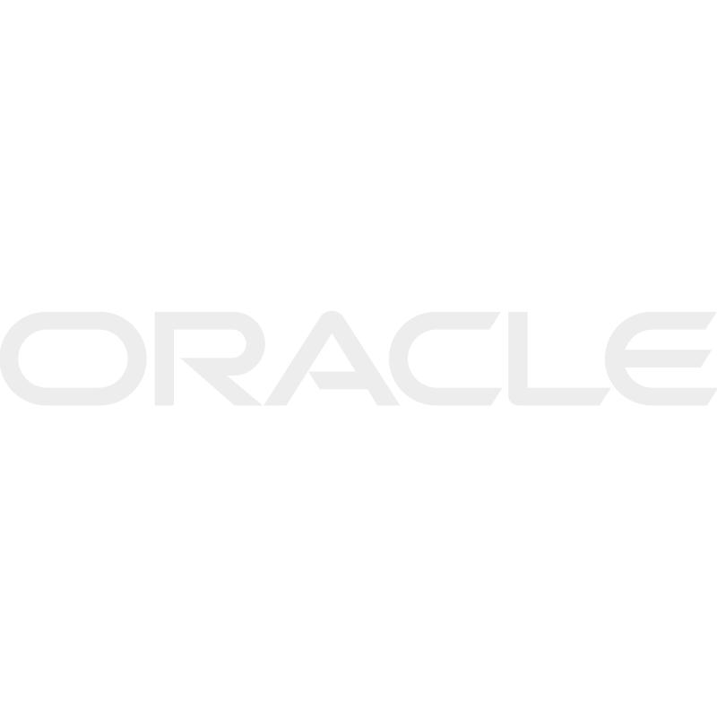
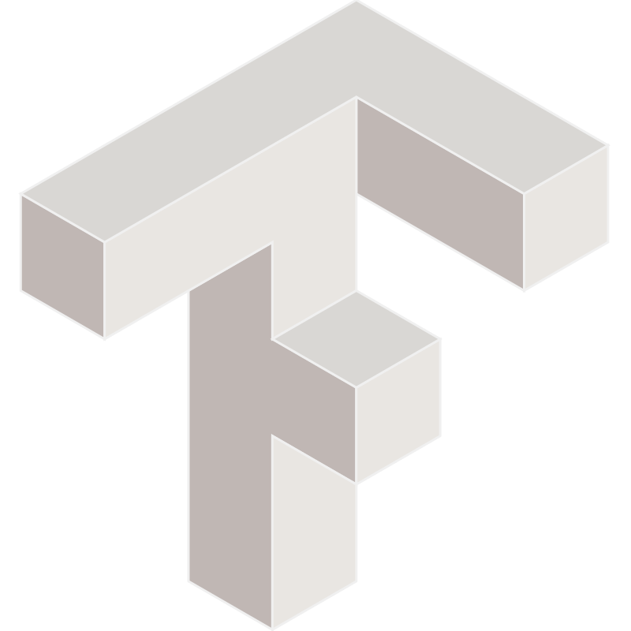

<h1 align="center">Hi 👋, I'm Edgar Alvarez</h1>
<h3 align="center">Systems Engineering Student (final year of college)</h3>

- 👨‍💻 All of my projects are available at [In-progress](In-progress)
- 📫 How to reach me **edgaralvares4208@gmail.com**
- 📄 Know about my experiences [In-progress](In-progress)

<h3 align="center">Connect with me:</h3>

    

    

<h3 align="center">Skills Resume</h3>

- **Frontend**: React, Astro, TailwindCSS
- **Backend**: FastAPI, Flask, Golang
- **DevOps**: Docker, Kubernetes, AWS, GCP

 

<h2 align="center">Portofilio</h2>
<!-- 

    

 -->

<h2 align="center">Proyects in progress</h2>
<!-- 

    

     -->

<h3 align="center">Skills and Tools</h3>
<table align="center">
    <tr>
        <td align="center"><b>Frontend</b></td>
        <td align="center"><b>Backend</b></td>
        <td align="center"><b>Languages</b></td>
        <td align="center"><b>Databases</b></td>
        <!-- <td align="center"><b>AI</b></td> -->
        <td align="center"><b>DevOps</b></td>
        <td align="center"><b>Tools</b></td>
        <td align="center"><b>Others</b></td>
    </tr>
    <tr>
        <td align="center">
            
            
            
        </td>
        <td align="center">
            
            
        </td>
        <td align="center">
            
            
            
            
            
        </td>
        <td align="center">
            
            
            
        </td>
        <!-- <td align="center">
            
        </td> -->
        <td align="center">
            
            
            
            
        </td>
        <td align="center">
            
            
        </td>
        <td align="center">
            
            
            
            
        </td>
    </tr>
</table>

 

    

