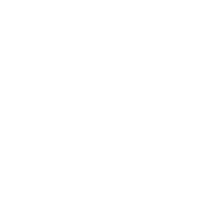

<h1 align="center">Hi 👋, I'm Edgar Alvarez</h1>
<h3 align="center">Systems Engineering Student in USAC (final year of college)</h3>

- 👨‍💻 My portfolio is available at [In-progress](In-progress)
- 📫 How to reach me **edgaralvares4208@gmail.com**

 

<table align="center" style="width: 100%; text-align: center; margin-top: 2rem; border-spacing: 1rem;">
    <tr align="center">
        <td style="font-weight: bold; font-size: 1.2rem;">CONTACT ME:</td>
        <td style="font-weight: bold; font-size: 1.2rem;">MY PORTFOLIO:</td>
    </tr>
    <tr align="center" style="height: 50px;">
        <td style="vertical-align: middle;">
            
        </td>
        <td style="vertical-align: middle;">
            
        </td>
    </tr>
</table>

 

<h2 align="center">🚀 PROJECTS</h2>
<table style="margin: auto; border-spacing: 2rem; width: 100%;">
  <!-- Proyecto 1 -->
  <tr>
    <td style="width: 50%; text-align: left; vertical-align: middle; padding: 1rem;">
      <h3>🎭 ANTAGONISTA.SITE</h3>
      

        A public voting website celebrating the 50th chapter of the manga <i>Antagonista</i> by Saikomic.
        Users can vote for their 3 favorite characters.
      

      
<b>Tech Stack:</b>

      

        
        
        
        
        
      

      

        
        
      

    </td>
    <td style="width: 50%; text-align: center; vertical-align: middle; padding: 1rem;" align="center">
      
    </td>
  </tr>

  <!-- Proyecto 2 -->
  <tr>
    <td style="width: 50%; text-align: center; vertical-align: middle; padding: 1rem;" align="center">
      
    </td>
    <td style="width: 50%; text-align: left; vertical-align: middle; padding: 1rem;">
      <h3>🏅 GKE-K8S-OLYMPIC-MICROSERVICES</h3>
      

        Cloud-native platform for tracking Olympic events at USAC in real time. Built with Go/Rust microservices,
        gRPC, Kafka, Redis, Grafana, and deployed on GKE with autoscaling and simulated traffic using Locust all using Kubernetes.
      

      
<b>Tech Stack:</b>

      

        
        
        
        
        
      

      

        
      

    </td>
  </tr>
</table>

 

<h2 align="center" style="margin-top: 2rem; font-weight: bold;">SKILLS AND TOOLS</h2>
<table align="center" style="border-collapse: collapse; text-align: center;">
    <tr>
        <td align="center" style="writing-mode: vertical-rl; transform: rotate(180deg);"><b>Frontend</b></td>
        <td>
            
            
            
            
        </td>
    </tr>
    <tr>
        <td align="center" style="writing-mode: vertical-rl; transform: rotate(180deg);"><b>Backend</b></td>
        <td>
            
            
        </td>
    </tr>
    <tr>
        <td align="center" style="writing-mode: vertical-rl; transform: rotate(180deg);"><b>Languages</b></td>
        <td>
            
            
            
            
        </td>
    </tr>
    <tr>
        <td align="center" style="writing-mode: vertical-rl; transform: rotate(180deg);"><b>Databases</b></td>
        <td>
            
            
        </td>
    </tr>
    <tr>
        <td align="center" style="writing-mode: vertical-rl; transform: rotate(180deg);"><b>DevOps</b></td>
        <td>
            
            
        </td>
    </tr>
    <tr>
        <td align="center" style="writing-mode: vertical-rl; transform: rotate(180deg);"><b>Tools</b></td>
        <td>
            
            
        </td>
    </tr>
    <tr>
        <td align="center" style="writing-mode: vertical-rl; transform: rotate(180deg);"><b>Others</b></td>
        <td>
            
            
            
        </td>
    </tr>
</table>

 

<h2 align="center">GitHub Stats</h2>

    

